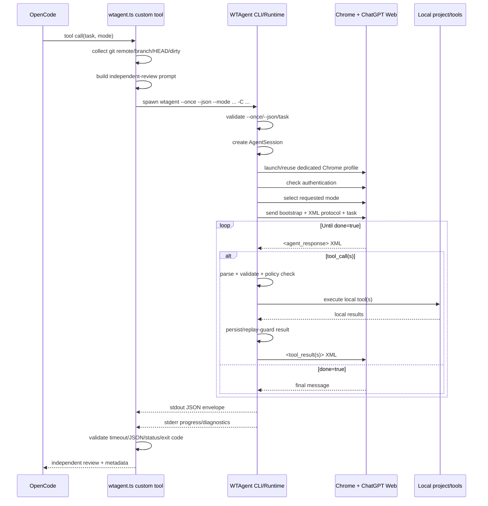

# OpenCode × WTAgent integration

This document describes the OpenCode integration in this fork at the **process, function, protocol, and failure-path level**.

The important architectural point is that WTAgent is **not an OpenCode model provider**. It is loaded by OpenCode as a custom tool, then launched as a separate local process. WTAgent drives ChatGPT Web in Chrome and exposes the local project to that web conversation through its own XML tool protocol.

## 1. High-level architecture

```text
┌───────────────────────────────────────────────────────────────┐
│ OpenCode process                                              │
│                                                               │
│  custom tool: wtagent                                        │
│  ~/.config/opencode/tools/wtagent.ts                          │
│                │                                              │
│                │ Bun.spawn(...)                               │
└────────────────┼──────────────────────────────────────────────┘
                 │
                 │ wtagent --once --json --mode <MODE>
                 │         -C <project> "<delegated task>"
                 ▼
┌───────────────────────────────────────────────────────────────┐
│ WTAgent Node.js process                                       │
│                                                               │
│  CLI -> AgentSession -> ConversationRunner -> AgentRuntime     │
│                       │                                       │
│                       ├─ local tool registry                   │
│                       ├─ policy engine                         │
│                       ├─ session / replay state                │
│                       └─ browser adapter                       │
└───────────────────────────────┬───────────────────────────────┘
                                │ CDP / browser automation
                                ▼
┌───────────────────────────────────────────────────────────────┐
│ Dedicated Chrome / Chromium profile                           │
│                                                               │
│                    ChatGPT Web conversation                   │
│                                │                              │
│                                │ XML tool requests             │
│                                ▼                              │
│                    WTAgent local Runtime                      │
│                                │                              │
│                fs.read / fs.search / terminal...              │
│                                │                              │
│                                └── XML tool results ──────────►│
└───────────────────────────────────────────────────────────────┘

Final ChatGPT message
        │
        ▼
WTAgent JSON envelope on stdout
        │
        ▼
OpenCode custom tool parses JSON
        │
        ▼
OpenCode receives the independent review
```

Recommended role:

> OpenCode remains the primary coding agent. WTAgent is an independent second reviewer that can inspect the same local worktree through ChatGPT Web.

A useful workflow is:

```text
OpenCode implements / investigates
        │
        ├──► WTAgent + ChatGPT independently inspects the worktree
        │
        ├──► OpenCode reconciles findings and fixes
        │
        └──► optional WTAgent regression review
```

---

## 2. OpenCode tool discovery

The integration file is a normal OpenCode custom tool:

```text
~/.config/opencode/tools/wtagent.ts
```

or project-scoped:

```text
<project>/.opencode/tools/wtagent.ts
```

The fork example is stored at:

```text
examples/opencode/wtagent.ts
```

It exports:

```ts
export default tool({
  description: "...",
  args: { ... },
  async execute(args, context) { ... },
})
```

The filename becomes the OpenCode tool name, so installing it as `wtagent.ts` exposes a `wtagent` tool to the OpenCode agent.

This is why no WTAgent-specific model/provider entry is required in `opencode.json`.

A minimal OpenCode config can remain:

```json
{
  "$schema": "https://opencode.ai/config.json"
}
```

---

## 3. OpenCode-side arguments

The fork adapter exposes two logical arguments:

```text
task
mode
```

### `task`

The independent analysis request sent to WTAgent.

Typical examples:

```text
Review the current implementation for regressions.
Investigate why this test fails on Windows.
Check this parser for malformed-input bugs.
Perform an independent security review of the changed code.
```

### `mode`

The fork example accepts:

```text
Instant
Medium
High
Pro
Current
```

Default:

```text
High
```

`Pro` is a fork-side addition to the original OpenCode demo. WTAgent itself supports explicit `--mode Pro` when that mode is available on the connected ChatGPT account.

The requested mode is not necessarily the final active mode. WTAgent records the result returned by the web adapter because ChatGPT may already be on that mode, may fall back, or may not expose the requested option for the current account/session.

---

## 4. OpenCode adapter execution path

The implementation is in:

```text
examples/opencode/wtagent.ts
```

The call path is approximately:

```text
OpenCode decides to call `wtagent`
        │
        ▼
execute(args, context)
        │
        ├─ collectRepositoryContext(context.directory)
        │
        ├─ buildRepositoryPrompt(...)
        │
        ├─ build delegatedTask
        │
        ├─ build command[]
        │
        ├─ Bun.spawn(command)
        │
        ├─ consume stdout + stderr + exit status concurrently
        │
        ├─ JSON.parse(stdout)
        │
        └─ return formatted review to OpenCode
```

### 4.1 Determine the local project

OpenCode passes its active project directory as:

```ts
context.directory
```

The adapter uses this value twice:

```text
child-process cwd
WTAgent -C / --project
```

That means the WTAgent project root is intentionally aligned with the OpenCode project root.

### 4.2 Collect Git repository context

Before WTAgent is launched, the adapter runs four Git commands concurrently:

```bash
git remote get-url origin
git branch --show-current
git rev-parse HEAD
git status --porcelain
```

The result is summarized as:

```text
Repository context:
- Repository: <normalized URL>
- Local branch: <branch>
- Local HEAD: <commit>
- Local worktree has uncommitted changes: yes/no
```

The remote normalizer handles common forms such as:

```text
git@github.com:owner/repo.git
ssh://git@github.com/owner/repo.git
https://github.com/owner/repo.git
http://github.com/owner/repo.git
```

This Git metadata is **not WTAgent configuration**. It is inserted into the delegated task text so the independent reviewer knows which local revision/worktree it is reviewing.

### 4.3 Build the delegated review prompt

The OpenCode adapter expands the user's review request with additional instructions.

The important semantic layers are:

```text
Original delegated task
        +
Repository context
        +
Independent-review strategy
        +
Local-worktree source-of-truth rule
        +
Read-only reviewer instructions
        +
Review-quality rules
```

The reviewer is explicitly told to:

- inspect the project itself rather than trust the calling agent's summary;
- treat the local WTAgent worktree as authoritative for uncommitted changes;
- use remote GitHub content only as supplementary context;
- distinguish confirmed findings from hypotheses;
- avoid manufacturing issues just to return findings.

### 4.4 Spawn WTAgent

The adapter constructs an argv array rather than an interpolated shell string:

```text
wtagent
--once
--json
--mode
<mode>
-C
<context.directory>
<delegatedTask>
```

Conceptually:

```bash
wtagent --once --json --mode High -C ./project "review this implementation"
```

It starts the process with:

```ts
Bun.spawn(command, {
  cwd: context.directory,
  env: process.env,
  stdout: "pipe",
  stderr: "pipe",
})
```

Important consequences:

- WTAgent inherits the OpenCode environment.
- WTAgent runs with the OpenCode project as its process working directory.
- arguments are passed as argv entries rather than concatenated into a shell command.

### 4.5 stdout and stderr are deliberately separated

WTAgent machine mode has a useful transport contract:

```text
stdout = one machine-readable JSON object
stderr = progress / diagnostics
```

The OpenCode adapter consumes:

```text
stdout
stderr
proc.exited
```

with one `Promise.all(...)`.

This matters because it both:

1. keeps stdout clean enough for strict JSON parsing; and
2. drains stderr concurrently so a full pipe cannot stall the child process.

### 4.6 OpenCode-side timeout

The fork adapter sets:

```text
30 minutes
```

as the outer WTAgent process timeout.

If it expires, the adapter attempts to kill the child and reports:

```text
WTAgent timed out after 30 minutes.
```

This is separate from WTAgent's own per-model-turn timeout.

---

## 5. WTAgent CLI machine-mode path

The relevant entry point is:

```text
src/cli/main.js
```

The top-level CLI uses Commander and defines:

```text
-C, --project <path>
--mode <name>
--once
--json
--model-turn-timeout-ms <milliseconds>
--no-minimize
--debug
[task...]
```

For the OpenCode path, the important pair is:

```text
--once --json
```

### 5.1 `--json` is intentionally restricted

WTAgent validates that:

```text
--json requires --once
```

and that JSON mode is only used for a top-level one-shot task.

Possible machine errors include:

```text
JSON_REQUIRES_ONCE
JSON_ONE_SHOT_ONLY
TASK_REQUIRED
```

### 5.2 `runAgent(...)`

`runAgent()` performs the first WTAgent-side setup:

```text
resolve project root
    │
assert project directory exists
    │
resolve WTAgent application/profile/session paths
    │
resolve web provider config
    │
normalize requested mode
    │
require initial task in one-shot JSON mode
    │
create AgentSession
    │
resolve any @file attachments
    │
executeSession(...)
```

The session records at least the logical task, project root, provider, and selected/requested mode state.

---

## 6. ConversationRunner and AgentRuntime

`executeSession()` creates a:

```text
ConversationRunner
```

which owns the per-conversation resources:

```text
browser adapter
ProcessManager
renderer
a persistent ApprovalStore
AgentRuntime instances used for turns
```

The relevant files are:

```text
src/cli/main.js
src/runtime/agent-runtime.js
src/policy/policy-engine.js
src/tools/default-tools.js
```

### Runtime construction

Conceptually:

```text
AgentRuntime
├─ adapter   -> ChatGPT Web browser adapter
├─ registry  -> local WTAgent tools
├─ policy    -> PolicyEngine
├─ session   -> persistent WTAgent session
├─ approval  -> interactive or machine-mode approval callback
└─ onEvent   -> renderer/session event stream
```

---

## 7. Browser startup and authentication

Inside `AgentRuntime.run()`:

```text
session -> phase=initializing
        │
        ▼
adapter.launch(...)
        │
        ▼
getAuthState()
        │
        ├─ authenticated -> continue
        │
        └─ guest / uncertain
              │
              ▼
        short login grace check
              │
              └─ still unauthenticated -> login path
```

In normal interactive mode WTAgent can restore the Chrome window and wait for the user to log in.

In JSON machine mode, the adapter is wrapped by `createMachineWebAdapter(...)`.

That wrapper deliberately prevents a non-interactive caller from hanging indefinitely waiting for manual login. After the short grace path is exhausted it raises:

```text
AUTH_REQUIRED
```

with guidance to run `wtagent login` first.

This is why OpenCode automation should normally be prepared with:

```bash
wtagent login
```

before using the custom tool.

---

## 8. Conversation and mode selection

After authentication WTAgent calls:

```text
adapter.startConversation(...)
```

For a new run this starts/uses a new web conversation. Resume paths can restore a previously saved conversation URL and assistant message ID.

Then WTAgent applies the requested mode when appropriate:

```text
requestedMode
    │
    ▼
adapter.selectMode(requestedMode)
    │
    ├─ select
    ├─ already
    ├─ fallback
    └─ unknown/unavailable
```

WTAgent stores the actual/observed `activeMode` separately from the requested value.

This distinction is useful when OpenCode requests `Pro` but the current ChatGPT account or UI cannot provide it.

---

## 9. WTAgent does not use native ChatGPT function calls

This is one of the most important implementation details.

The browser-side conversation does **not** rely on ChatGPT having native filesystem tools or OpenAI API function calling.

Instead, WTAgent constructs a transport prompt in:

```text
src/protocol/prompt-builder.js
```

The bootstrap explicitly tells ChatGPT:

```text
You do not have direct access to the user's filesystem.
Return requested local operations as XML text.
The user's local Node.js Runtime will parse, validate, and execute them.
```

ChatGPT must return one XML document inside an XML code fence.

A single local operation looks conceptually like:

```xml
<agent_response>
  <done>false</done>
  <message>Inspecting the source.</message>
  <tool_call name="fs.read">
    <args>
      <path>src/index.js</path>
    </args>
  </tool_call>
</agent_response>
```

Multiple independent calls can be batched:

```xml
<agent_response>
  <done>false</done>
  <message>Reading the related files together.</message>
  <tool_calls>
    <tool_call id="source" name="fs.read">
      <args><path>src/index.js</path></args>
    </tool_call>
    <tool_call id="test" name="fs.read">
      <args><path>test/index.test.js</path></args>
    </tool_call>
  </tool_calls>
</agent_response>
```

A completed answer is:

```xml
<agent_response>
  <done>true</done>
  <message>Final review findings...</message>
</agent_response>
```

So the real control path is:

```text
ChatGPT Web emits XML text
        │
        ▼
WTAgent parseAgentResponse(...)
        │
        ▼
validate tool name + arguments
        │
        ▼
PolicyEngine.evaluate(...)
        │
        ▼
local ToolRegistry.execute(...)
        │
        ▼
serialize result back to XML
        │
        ▼
send next user message to same ChatGPT conversation
```

This loop repeats until ChatGPT returns:

```text
<done>true</done>
```

---

## 10. Local tool execution loop

The core implementation lives in:

```text
src/runtime/agent-runtime.js
```

A simplified turn is:

```text
send bootstrap / follow-up / tool result
        │
        ▼
waitForTurnComplete()
        │
        ▼
parseAgentResponse(raw)
        │
        ├─ protocol invalid
        │      └─ send protocol error back to ChatGPT and retry
        │
        ├─ done=true
        │      └─ finish run
        │
        └─ tool_call(s)
               │
               ▼
        prepare tool plan(s)
               │
               ├─ registry.validate()
               ├─ replay / side-effect guard checks
               └─ policy.evaluate()
               │
               ▼
        resolve required approvals
               │
               ▼
        registry.execute()
               │
               ▼
        persist result / transcript / replay state
               │
               ▼
        send <tool_result> / <tool_results>
               │
               └──────────────► next ChatGPT turn
```

### Tool validation

Before execution WTAgent validates each requested tool against the tool registry schema.

Invalid XML arguments or unknown/invalid requests become tool errors rather than blindly executing arbitrary text.

### Tool registry

The default registry in:

```text
src/tools/default-tools.js
```

contains local operations such as filesystem listing/reading/searching/editing and command/process operations.

Examples include:

```text
fs.list
fs.read
fs.search
fs.write
fs.edit
terminal.exec
...
```

The browser does not execute these. The **local WTAgent Node.js process** does.

### Tool results

A local result is serialized and sent back into the same ChatGPT Web conversation as an XML tool result.

ChatGPT then reasons over the returned local evidence and either:

```text
asks for more tools
```

or:

```text
returns done=true with a final answer
```

---

## 11. Replay and side-effect protection

WTAgent persists enough session/tool state to reduce accidental repeated side effects across retries/resumes.

The runtime derives deterministic identities/fingerprints from information including:

```text
session id
assistant message identity
requested tool
canonicalized arguments
```

It distinguishes read-like operations from side-effecting operations and stores execution state/results.

Important behavior includes:

- completed results can be reused rather than blindly replayed;
- a side effect whose completion is uncertain is marked as such instead of being automatically rerun;
- a changed tool request associated with the same recorded operation can be treated as a conflict;
- pending tool results are persisted so a resumed conversation can receive them again safely.

This is particularly important because a browser connection may disappear while a local command is running.

---

## 12. Browser/recovery behavior

The Runtime contains several recovery paths.

### Browser connection loss

If the CDP/browser connection disappears, WTAgent can reconnect to the still-running Chrome and restore the saved conversation URL.

A message send or reply wait is retried in constrained cases rather than restarting the entire task from scratch.

### Empty assistant response / dead request

If ChatGPT produces an empty response or the request appears dead, WTAgent sends a transport-only continuation message instead of resending the original local operation.

This is designed to avoid duplicating tool side effects.

### Protocol error

If the web reply is not valid WTAgent XML:

```text
parseAgentResponse(...)
        │
        └─ ProtocolError
              │
              ▼
        serializeProtocolError(...)
              │
              ▼
        send correction request to ChatGPT
```

After too many consecutive protocol failures, the run terminates.

### Usage limit

WTAgent detects ChatGPT usage-limit conditions and terminates the run with a clear error rather than repeatedly retrying a response that cannot succeed.

---

## 13. Approval behavior in JSON mode

Interactive WTAgent can ask:

```text
Allow once
Always allow <tool>
Always allow everything
Deny
```

Machine JSON mode cannot stop to ask a human.

When `PolicyEngine` returns:

```text
action = confirm
```

`ConversationRunner` throws:

```text
APPROVAL_REQUIRED
```

before executing the protected operation.

For a batch, WTAgent resolves all confirmations before starting any tool in that batch. This prevents an earlier operation from executing when a later operation in the same batch would require unavailable interactive approval.

However, see the safety section below: **not every write is classified as confirmation-required**.

---

## 14. Machine JSON result

The final machine-output implementation is:

```text
src/cli/machine-output.js
```

Successful run:

```json
{
  "schemaVersion": 1,
  "status": "completed",
  "sessionId": "session_...",
  "result": "final ChatGPT message",
  "projectRoot": "/path/to/project"
}
```

Error:

```json
{
  "schemaVersion": 1,
  "status": "error",
  "error": {
    "code": "ERROR_CODE",
    "message": "...",
    "details": {}
  }
}
```

In JSON mode, ordinary human logs are redirected to stderr so stdout remains one JSON object.

At the CLI top level:

```text
runAgent(...)
    │
    ├─ success -> createMachineSuccess(...)
    │             -> writeMachineOutput(stdout)
    │
    └─ error   -> createMachineError(...)
                  -> writeMachineOutput(stdout)
                  -> exitCode = 1
```

---

## 15. OpenCode receives and validates the machine result

Back in `examples/opencode/wtagent.ts`, the parent OpenCode process has been waiting on:

```text
stdout
stderr
exit code
```

The adapter then applies these checks:

```text
Did the outer 30-minute timer fire?
        │ yes -> timeout error
        ▼ no
Is stdout empty?
        │ yes -> no JSON result error
        ▼ no
Does JSON.parse(stdout) succeed?
        │ no -> invalid JSON error
        ▼ yes
payload.status == "error" ?
        │ yes -> expose WTAgent code/message/details + stderr diagnostics
        ▼ no
exitCode != 0 ?
        │ yes -> inconsistent completed/nonzero error
        ▼ no
return payload.result to OpenCode
```

The tool response returned to OpenCode also includes useful execution metadata:

```text
mode
repository URL
branch
HEAD
whether local changes exist
WTAgent session ID
WTAgent project root
final review result
```

OpenCode can then reason over those findings and decide whether to change code, reject a hypothesis, or request another independent review.

---

## 16. End-to-end sequence diagram



---

## 17. Source-of-truth rules

There are three different sources of information in this integration:

### Local WTAgent worktree

Use as authoritative for:

```text
uncommitted changes
generated files
git diff
local tests
runtime behavior
```

### Remote GitHub repository

Useful for:

```text
committed history
documentation
repository navigation
cross-reference
```

but it may lag behind local edits.

### OpenCode's own prior analysis

Treat as a hypothesis, not evidence for the independent reviewer.

The adapter deliberately tells WTAgent/ChatGPT to inspect the project rather than simply agree with the calling OpenCode agent.

---

## 18. Security and permission boundary

This section is important because there are multiple layers that are easy to confuse.

### 18.1 What ChatGPT Web actually sees

ChatGPT Web does not automatically have direct filesystem access through WTAgent.

It receives:

```text
bootstrap protocol
user/delegated task
explicitly returned tool results
```

When ChatGPT needs a local operation it asks for one as XML text. WTAgent decides whether/how that request is executed.

### 18.2 The OpenCode adapter says "read-only reviewer"

The fork adapter adds prompt constraints such as:

```text
Do not modify files.
Do not create files.
Do not delete files.
Do not run destructive commands.
Do not commit.
Do not push.
Do not merge.
Do not publish.
```

These instructions are valuable, but they are **model-level instructions**.

### 18.3 Important: WTAgent is not hard read-only here

The default WTAgent registry contains write-capable operations such as:

```text
fs.write
fs.edit
terminal.exec
```

The current `PolicyEngine` does not classify every in-project write as confirmation-required merely because it is a write.

Its confirmation logic primarily adds reasons for cases such as:

- paths outside the selected project;
- privilege escalation;
- destructive command programs;
- inline shell/interpreter commands;
- `git push`;
- package publication/deployment-like commands;
- sensitive environment inheritance.

Therefore:

> If ChatGPT violates the review prompt and requests an ordinary allowed write inside the project, WTAgent has the technical ability to execute it.

`--once --json` by itself does **not** turn the project into a read-only filesystem.

`APPROVAL_REQUIRED` only protects operations for which the policy actually returns `confirm`. Persisted `Always allow` decisions can also relax confirmation behavior.

### 18.4 If hard read-only is required

Use one or more of these approaches:

```text
1. OS/container/filesystem read-only sandbox
2. a dedicated WTAgent tool registry containing only read tools
3. a stricter PolicyEngine that denies write/exec tools for reviewer mode
4. a separate reviewer-specific WTAgent mode implemented in Runtime
```

For sensitive source trees, an OS-level read-only boundary is the strongest option.

---

## 19. Failure map

| Layer | Example condition | Result |
|---|---|---|
| OpenCode adapter | outer timeout | child killed, timeout returned to OpenCode |
| OpenCode adapter | empty stdout | adapter error |
| OpenCode adapter | invalid JSON | adapter error with stdout/stderr diagnostics |
| WTAgent CLI | `--json` without `--once` | `JSON_REQUIRES_ONCE` |
| WTAgent CLI | no task in one-shot JSON | `TASK_REQUIRED` |
| WTAgent browser | login unavailable | `AUTH_REQUIRED` |
| WTAgent policy | human confirmation needed in JSON mode | `APPROVAL_REQUIRED` |
| WTAgent browser | usage limit | `USAGE_LIMIT_REACHED` |
| WTAgent protocol | malformed model XML | correction/retry, eventually error if exhausted |
| WTAgent runtime | connection loss | constrained reconnect/restore path |
| WTAgent runtime | uncertain side-effect completion | recorded as unknown; not blindly replayed |
| WTAgent success | ChatGPT emits `done=true` | machine success JSON returned to OpenCode |

---

## 20. Installation

Requirements:

- Node.js 20.17+
- Chrome / Chromium
- OpenCode
- WTAgent
- ChatGPT Web account/session

Install WTAgent:

```bash
npm install -g wtagent
wtagent login
```

Install this fork's OpenCode adapter globally:

```text
copy examples/opencode/wtagent.ts
  -> ~/.config/opencode/tools/wtagent.ts
```

Native Windows path is normally under:

```text
%USERPROFILE%\.config\opencode\tools\wtagent.ts
```

Project-local alternative:

```text
<project>/.opencode/tools/wtagent.ts
```

---

## 21. Manual machine-mode smoke test

Before debugging OpenCode integration, test WTAgent directly:

```bash
wtagent --once --json --mode High -C ./project "Inspect the project and summarize its architecture without changing files."
```

Expected stdout shape:

```json
{"schemaVersion":1,"status":"completed","sessionId":"session_...","result":"...","projectRoot":"..."}
```

If this fails, fix WTAgent/browser/login first. If it succeeds but the OpenCode tool fails, investigate the custom-tool layer separately.

This split makes troubleshooting much easier:

```text
Layer A: WTAgent + Chrome + ChatGPT Web
Layer B: OpenCode custom tool -> WTAgent child process
```

---

## 22. Recommended usage

Good WTAgent delegation points:

- independent code review;
- difficult debugging;
- regression analysis;
- architecture review;
- security analysis;
- test failure investigation;
- checking a conclusion reached by the primary agent;
- final review before accepting a large change.

Avoid invoking it for every trivial edit. Each call creates a real browser/model reasoning run, so it is most useful at checkpoints where an independent second reasoning chain adds value.

---

## 23. Relevant source files

| Purpose | Source |
|---|---|
| Fork OpenCode custom tool | [`examples/opencode/wtagent.ts`](../examples/opencode/wtagent.ts) |
| Original upstream demo retained in fork | [`opencode-call-wtagent-demo.ts`](../opencode-call-wtagent-demo.ts) |
| WTAgent CLI / machine-mode entry | [`src/cli/main.js`](../src/cli/main.js) |
| Machine JSON envelope | [`src/cli/machine-output.js`](../src/cli/machine-output.js) |
| Core browser/tool loop | [`src/runtime/agent-runtime.js`](../src/runtime/agent-runtime.js) |
| ChatGPT XML bootstrap protocol | [`src/protocol/prompt-builder.js`](../src/protocol/prompt-builder.js) |
| Default local tools | [`src/tools/default-tools.js`](../src/tools/default-tools.js) |
| Policy / approval classification | [`src/policy/policy-engine.js`](../src/policy/policy-engine.js) |

The most useful reading order for understanding the integration is:

```text
examples/opencode/wtagent.ts
        ↓
src/cli/main.js
        ↓
src/runtime/agent-runtime.js
        ↓
src/protocol/prompt-builder.js
        ↓
src/tools/default-tools.js + src/policy/policy-engine.js
```
